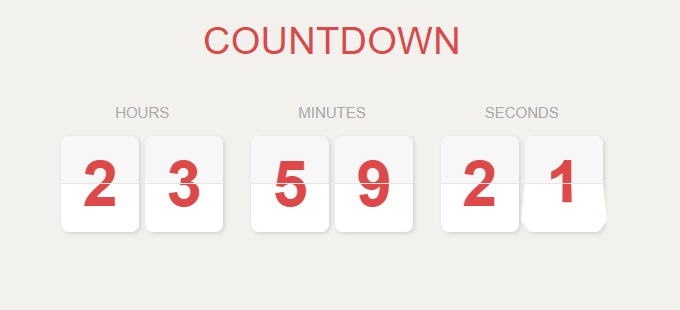
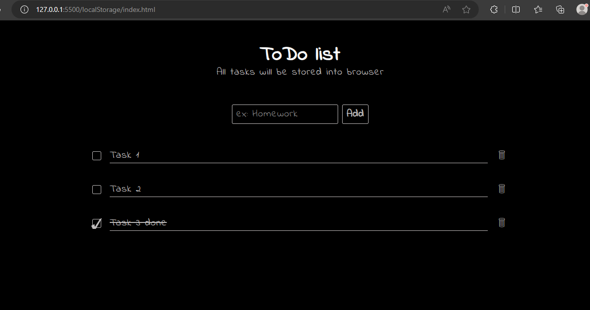

# js-projects
simple widgets from what i've been learning recently in js ✨.

**Each folder contain different component/wedgit**

## 1. Count Down Timer with card flipping design

### How to use ?
- very simple to use and customize ,by default it will count 24 hours from the moment js code runs, you can adjust count down time from CountDown/script.js line 6 .

### issues could be fixed:

1 - js code contain overhead processing (calling flip function for all digits each second)
  
2 - the animation depends on appending and creating new html elements

---

## 2. Todo list (using local storage) 📓

- `localStorage` is an object of BOM it's storing data within user **Browser**
- obviously it's not a good place to store notes but its ok for practicing, click [here](https://www.freecodecamp.org/news/how-to-store-objects-or-arrays-in-browser-local-storage/#:~:text=Local%20storage%20is%20useful%20for,out%20to%20the%20server%20for.) to see common local storage use cases
- dont forgut to execute `loclaStorage.clear()`

